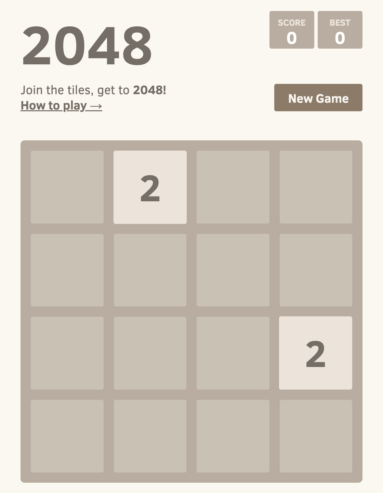
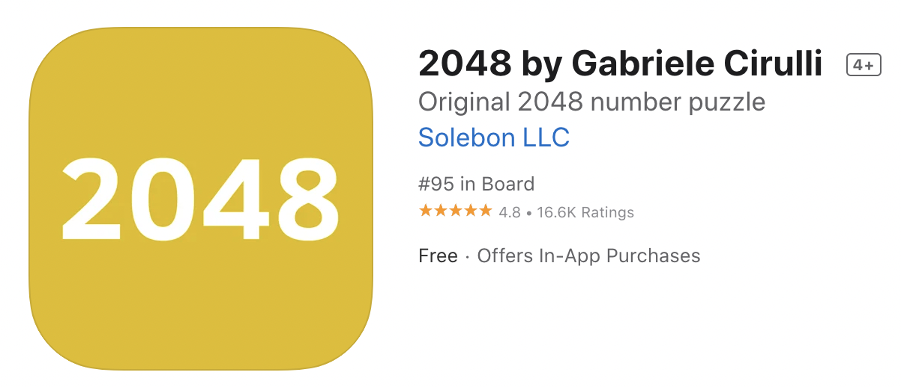
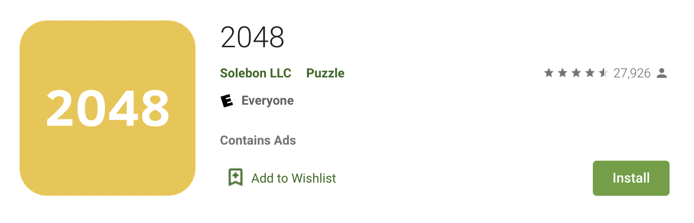

# Documentation Project DRAFT
##### Katherine Beal
## Introduction
The app 2048 is a single-player video game. The puzzle game has sliding tiles with different powers of 2. When two tiles with the same value slide into one another, they combine to create the next power of two. The goal of the game is to get the 2048 tile, or combine tiles of 2 11 times.

## Installation
2048 is available on Web browser, iOS, and Android. Many more downloads of the game exist, but they are not the original version and should be downloaded and used with caution. 

Web Browser
>To use 2048 on a web browser, go to the following [link][p].  

iOS
>To download 2048 on iOS, search 2048 in the Apple App store.

Android
>To download 2048 on Android, search 2048 on the Android app store. 

## Instructions

Web Browser
>1. Go to the link above. 
>2. Use the arrow keys to slide the blocks on the screen. The up arrow will slide all the blocks on the screen up, the left arrow to the left, and so on.
>3. The game will automatically generate 2 and 4 blocks with every move. Use the blocks to create bigger numbers. 
>4. The game will end when the screen is full and none of the blocks can combine. Good Luck!
     
iOS or Android
>1. Open the application.
>2. Use your finger to slide the blocks on the screen. Swipe up to slide all the blocks on the screen up, swipe left to slide the blocks to the left, and so on. 
>3. The game will automatically generate 2 and 4 blocks with every move. Use the blocks to create bigger numbers. 
>4. The game will end when the screen is full and none of the blocks can combine. Good Luck!
     
## FAQ
I got the 2048 block. Now what?
> Congrats! You can keep playing and combine to even higher numbers.

How high do the numbers go?
> Theoretically, 131072 is possible, but extremely unlikely because the board is limited to only 16 squares. To get 131072, the board would need 65536, 32768, 16384, 8192, 4096, 2048, 1024, 512, 256, 128, 64, 32, 16, 8, 4, 4, which would fill the entire 16 squares. 

[//]: # (Links)
[p]: <https://play2048.co/>
